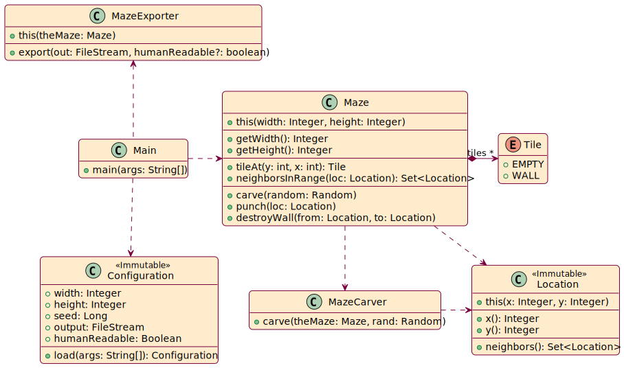
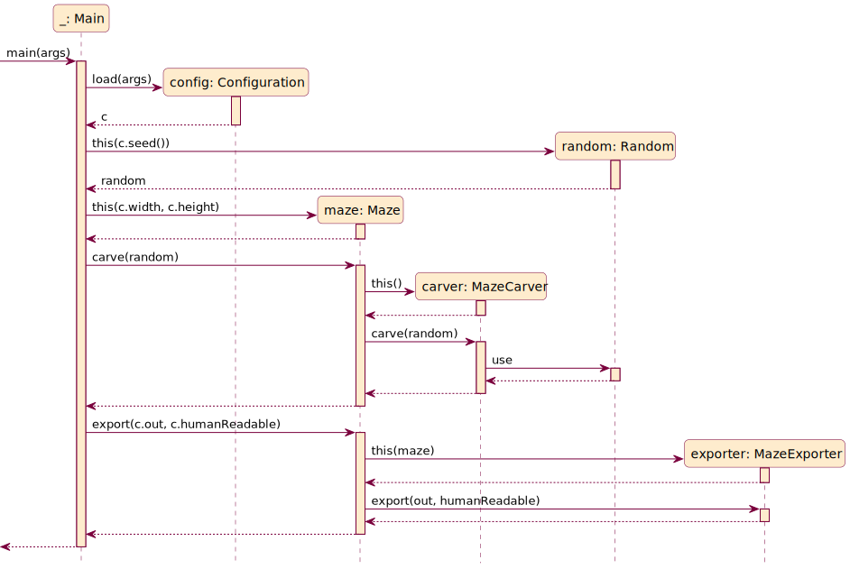

# Maze Generator


- Author: Dr. [Sébastien Mosser](https://mosser.github.io)
- Version: 2024.01
- Context: McMaster University > Engineering > Computing & Software > SFWRENG > 2AA4
- License: [CC BY-NC-SA 4.0](https://creativecommons.org/licenses/by-nc-sa/4.0/)

## Description

This is a classical maze generation implementation, using a tile map approach to carve a maze through a grid of walls.
We use Prim's algorithm to support the generation. The algorithm is described in details in this [blog post by Jamis Buck](https://weblog.jamisbuck.org/2011/1/10/maze-generation-prim-s-algorithm). It basically consider a maze entirely made of walls, and carves a perfect maze out of it.

## How to use this software?

To compile the source code into a turn-key _Java ARchive_ (JAR):

```
mosser@azrael maze-gen % mvn -q clean package  
```

To run the generator:

```
mosser@azrael maze-gen % java -jar target/tennis.jar -w WIDTH -h HEIGTH  -o OUTPUT_FILE -s SEED -human 
```

- `-w` specifies the width of the maze, an odd integer greater or equals to 5. Default is 41.
- `-h` specifies the height of the maze, an odd integer greater or equals to 5. Default is 41.
- `-o` specifies the output file to use. Default is `stdout`
- `-s` specified the [seed](https://en.wikipedia.org/wiki/Random_seed) to be used by the random number generation
- `-human` indicates to the program to double the symbols used to print the maze, making it easier to read by a human.


### Examples

An 11x11 maze readable by a human:

```
mosser@azrael maze-gen % java -jar target/mazegen.jar -w 11 -h 11 -human 
######################
##  ##  ##  ##  ##  ##
##  ##  ##  ##  ##  ##
##                  ##
##  ######  ######  ##
    ##          ##  ##
##  ######  ######  ##
##  ##      ##  ##  ##
##  ##  ##  ##  ######
##  ##  ##            
######################
```

A 7x7 maze without the readable option (harder to read, but easier to parse)

```
mosser@azrael maze-gen % java -jar target/mazegen.jar -w 7 -h 7 
#######
#     #
### ###
    # #
### #  
#     #
#######

```

An 11x11 maze using `42` as a seed, and thus, always producing the same result.

```
mosser@azrael maze-gen % java -jar target/mazegen.jar -w 11 -h 11 -human -s 42
######################
##          ##  ##  ##
##  ##########  ##  ##
##                  ##
##  ##  ##########  ##
##  ##          ##    
    ##  ##  ######  ##
##  ##  ##      ##  ##
##  ##  ##  ##  ##  ##
##  ##  ##  ##  ##  ##
######################

```

## Design Description

### Class structure & Responsibilities



- `Main` is the entry point for the generation process. It loads configuration, and instantiate the maze using these info.
- `Configuration` use Apache CLI to load information provided by the user on the command line, and use default values when not provided. This class is _immutable_, as its content will never change once loaded.
- `Tile` represent the kind of tiles existing in the maze, being an empty tile or a wall.
- `Maze` is the main part of the process, initialized as a maze made entirely out of walls. It defines the data structure used to store the tiles used, with methods to access the tiles or carve tunnels. It also exposes two methods to (1) carve its content and (2) export it to a tectual file. These two methods delegate their behavior to dedicated objects to respect the _single responsibility_ principle.
- `MazeCarver` implements Prim's algorithm to carve the maze.
- `MazeExporter` traverses the maze to print it into the file received as argument.

### Generation process (bird view description)




The generation process orchestrates the previously described classes to support the configuration, carving and then exportation of the maze.

1. First, we load the configuration
2. Then, we instantiate a `Random` generator, which will be the only way of supporting randomness in the program
    - As such, we ensure by design that mazes are reproducible
3. We then instantiate a `Maze`, initialized as a buch of walls with no tunnels
4. We call the `carve` method on the maze to dig the tunnels. It delegates the work to a `MazeCarver`
    - This method is the one relying on randomness, and as such rely on the previously instantiated `Random` generator 
5. We finally call the `export` method on the maze to store the maze on a file. It delegates the work to a `MazeExporter`